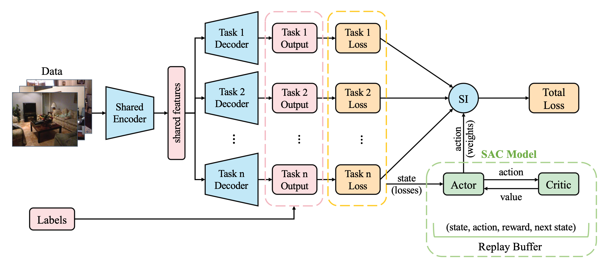

**Abstract:** In multi-task learning (MTL), gradient balancing has recently attracted more research interest than loss balancing since it often leads to better performance. However, loss balancing is much more efficient than gradient balancing, and thus it is still worth further exploration in MTL. Note that prior studies typically ignore that there exist varying improvable gaps across multiple tasks, where the improvable gap per task is defined as the distance between the current training progress and desired final training progress. Therefore, after loss balancing, the performance imbalance still arises in many cases. In this paper, following the loss balancing framework, we propose two novel improvable gap balancing (IGB) algorithms for MTL: one takes a simple heuristic, and the other (for the first time) deploys deep reinforcement learning for MTL. Particularly, instead of directly balancing the losses in MTL, both algorithms choose to dynamically assign task weights for improvable gap balancing. Moreover, we combine IGB and gradient balancing to show the complementarity between the two types of algorithms. Extensive experiments on two benchmark datasets demonstrate that our IGB algorithms lead to the best results in MTL via loss balancing and achieve further improvements when combined with gradient balancing. Code is available at [https://github.com/YanqiDai/IGB4MTL](https://github.com/YanqiDai/IGB4MTL).

Download paper [here](../files/Improvable_Gap_Balancing_for_Multi-Task_Learning-paper.pdf).  
Download poster [here](../files/Improvable_Gap_Balancing_for_Multi-Task_Learning-poster.pdf).

Recommended citation:  
Yanqi Dai, Nanyi Fei, Zhiwu Lu. Proceedings of the Thirty-Ninth Conference on Uncertainty in Artificial Intelligence, PMLR 216:496-506, 2023.
